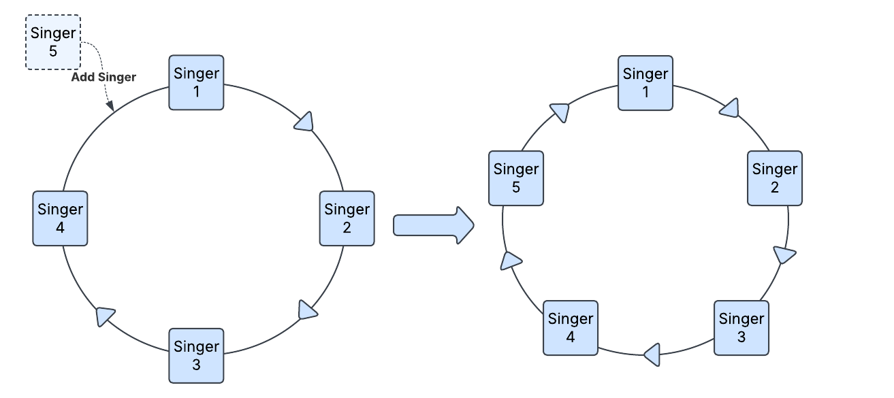
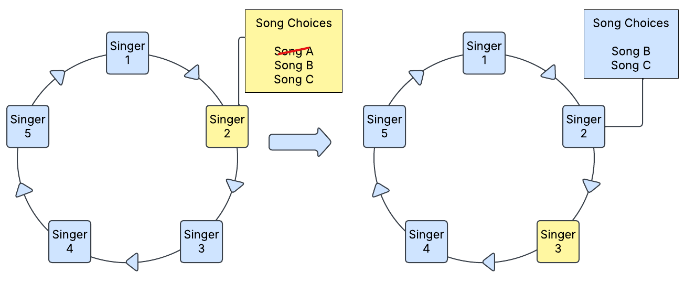
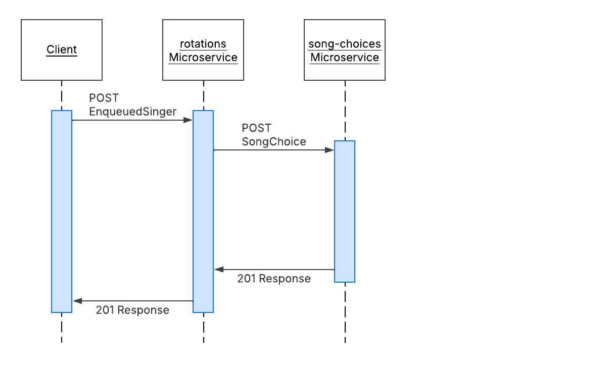
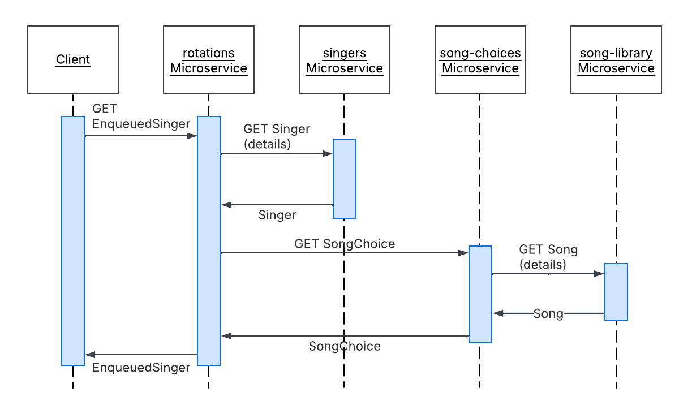
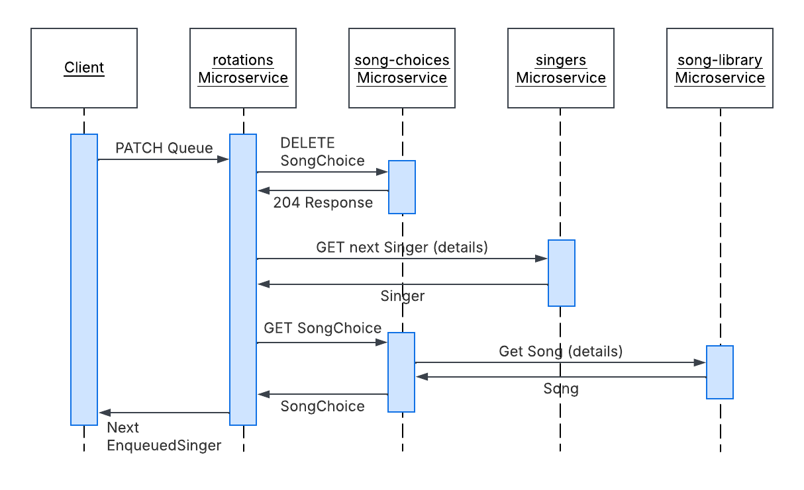

---
# Page settings
layout: default
keywords:
comments: false

# Hero section
title: Domain-Driven Design
description: Page description

# Author box
author:
    title: About Author
    title_url: '#'
    external_url: true
    description: Author description

# Micro navigation
micro_nav: true

# Page navigation
page_nav:
    prev:
        content: Project Overview
        url: '/overview'
    next:
        content: The Microservices
        url: '/microservices'
---

    
<strong>Lorem ipsum dolor sit amet!</strong> Lorem ipsum dolor sit amet, consectetur adipisicing elit, sed do eiusmod tempor incididunt ut labore et dolore magna aliqua.

    
Lorem ipsum dolor sit amet, consectetur adipisicing elit, sed do eiusmod tempor incididunt ut labore et dolore magna aliqua.

## The Use-Case
Lorem ipsum dolor sit amet, consectetur adipiscing elit, sed do eiusmod tempor incididunt ut labore et dolore magna aliqua. Ut enim ad minim veniam, quis nostrud exercitation ullamco laboris nisi ut aliquip ex ea commodo consequat. Duis aute irure dolor in reprehenderit in voluptate velit esse cillum dolore eu fugiat nulla pariatur. Excepteur sint occaecat cupidatat non proident, sunt in culpa qui officia deserunt mollit anim id est laborum.

## Decomposing to Microservices

### CRUD - Singers and Songs

### The Queue

### Song Choices

### Microservices Working Together

### Purpose-Built Databases